# Workflow Flexível Overview

Esse novo tipo de Workflow permite que você defina processos de aprovação para documentos de acordo com suas necessidades e foi introduzido no SAP S/4HANA como um conjunto de melhorias para o SAP Business Workflow. Ao utilizar o workflow flexível, você pode simplificar sua configuração.

O Workflow flexível é estruturado sobre um conjunto de objetos de implementação predefinidos, incluindo cenários de Workflow, atividades, condições de início e de etapa, além de regras de determinação de agentes. O recurso integra funcionalidades como notificação por e-mail, monitoramento de prazos vencidos e tratamento de exceções durante o processo de aprovação.

No que se refere à extensibilidade, o Workflow flexível permite:

- Definir condições personalizadas;
- Criar regras de agente personalizadas;
- Configurar listas de destinatários possíveis para encaminhamento de tarefas;
- Determinar lógica para definição de prioridade de tarefas;
- Especificar processadores excluídos;
- Atribuir valores a atributos personalizados exibidos no aplicativo My Inbox.

Por meio dos aplicativos de administração de Workflow, o administrador pode localizar Workflows com erros, visualizar detalhes e realizar procedimentos de troubleshooting.

## Apps Fiori

O aplicativo **Manage Workflows** permite que um especialista em processos de negócios modele workflows com base nos requisitos do negócio, utilizando objetos predefinidos e funções integradas. Aqui, é possível configurar o fluxo do processo, definir condições de início, atribuir destinatários e definir o tratamento de exceções. É possível modelar processos de aprovação de uma ou várias etapas. As tarefas de aprovação relevantes ficam disponíveis para os aprovadores no aplicativo **My Inbox**. O workflow flexível oferece suporte à função de simulação e disponibiliza um componente reutilizável para exibir detalhes de aprovação, incluindo etapas concluídas e planejadas.

O workflow flexível também oferece diversas opções de extensibilidade. É possível definir condições personalizadas, regras de agentes personalizadas e uma lista de possíveis destinatários ao encaminhar tarefas. Você pode definir a lógica para configurar a prioridade da tarefa, a lista de processadores excluídos e os valores de atributos personalizados exibidos no aplicativo **My Inbox**.

Usando os aplicativos para administração de workflows, um administrador pode buscar workflows com erros, exibir erros e realizar a resolução de problemas.

Workflows criados no ambiente on-premise via SAPGUI (transações clássicas como SWDD) estão disponíveis para configuração no app Fiori Manage Workflows. Porém, workflows criados ou customizados diretamente no app Fiori Manage Workflows NÃO ficam disponíveis para edição no SAPGUI. A razão é que os apps Fiori oferecem uma interface moderna e simplificada para configuração e gestão, enquanto o SAPGUI permite o desenvolvimento completo dos workflows. Os workflows criados no SAPGUI são compatíveis para serem gerenciados via Fiori, mas alterações feitas no Fiori não são sincronizadas de volta para o ambiente SAPGUI.

### APPs relacionados

- Flexible Workflow Administration
- Continue Scenario Workflows
- Continue Workflows
- Manage Workflow
- Manage Workflow Scenarios
- Restart Scenario Workflows
- Restart Suspended Workflows
- Restart Workflows
- Scenario Background Tasks
- Scenario Dialog Tasks
- Scenario Work Items
- Work Items Without Agents
- Work Items per Task
- Workflow Administration
- Workflow System Job Adminstration
- Workflow System Jobs
- Workflows in Status Error
- Workflows with Issues

## Comparando o Clássico com o Flexível

| Recurso | Workflow Clássico | Workflow Flexível |
| --- | --- | --- |
| Disponibilidade | SAP ERP, SAP S/4HANA | SAP S/4HANA |
| Configurado pelo app Manage Workflows | Não | Sim |
| Itens de trabalho | Sim | Sim |
| Integração com My Inbox | Sim | Sim |
| Tipo de processo suportado | Sequencial/paralelo | Sequencial |
| Workflows ad hoc | Não | Sim, no módulo de gestão do ciclo de vida do produto (PLM) para workflows flexíveis |
| Eventos | Sim | Sim |
| Integração com o app Manage Teams and Responsabilities para determinação de agente | Não | Sim, mas não disponível para workflows personalizados |
| Substituição disponível (ativa/passiva) | Sim | Sim |
| Workflow configurado por | Desenvolvedores (equipe de TI) | Especialista em processos de negócios |
| Tratamento de exceções | Tratado com modelagem de fluxo | Tratamento de exceções no app Manage Workflows para ações negativas |
| Monitoramento de prazos | Sim | Sim (a partir da versão SAP S/4HANA 1909) |
| Integração com o app Manter Modelo de E-mail | Não | Sim (a partir da versão SAP S/4HANA 1909) |
| Construtor de Workflow | Transação SWDD | Transação SWDD_SCENARIO |
| Registros de workflow | Sim | Sim |
| Complexidade dos workflows | De baixa a complexa, podendo ser modelada | Normalmente, fluxos complexos divididos em fluxos menores condicionais sequenciais no app Manage Workflows |

### Qual utilizar? 

```mermaid
flowchart TD
    A[Requisitos de Negócio] --> B{Sistema?}
    B -->|SAP ERP| C[Workflows Clássicos]
    B -->|SAP BTP| D[Workflows SAP BTP]
    B -->|SAP S/4HANA On-Premise| E{Complexidade / Fluxo de Aprovação?}
    E -->|Aprovações Complexas/Paralelas| C
    E -->|Aprovações Sequenciais| F[Workflows Flexíveis]
``` 

# Cenários

## Cenários Pré-Definidos

| Workflow Scenario ID | Nome do Workflow                                            | Standard Task ID | Nome da Tarefa                                                       |
| -------------------- | ----------------------------------------------------------- | ---------------- | -------------------------------------------------------------------- |
| WS00800157           | Liberação Geral da Requisição de Compras                    | TS00800547       | Liberação geral da RC                                                |
| WS00800173           | Liberação de Item da Requisição de Compras                   | TS00800548       | Liberação de item da RC                                              |
| WS00800193           | Workflow para Cotação de Fornecedor                          | TS00800462       | Liberação da cotação do fornecedor                                   |
| WS00800238           | Workflow para Pedido de Compras                              | TS00800531       | Liberação do pedido de compras (manual)                              |
| WS00800251           | Workflow para Fatura Bloqueada                               | TS00800538       | Liberação da fatura bloqueada                                        |
| WS00800302           | Workflow para Solicitação de Cotação (RFQ)                   | TS00800576       | Liberação de RFQ                                                      |
| WS00800303           | Workflow para Fatura Provisória como Concluída               | TS00800577       | Liberação de fatura concluída                                        |
|                      |                                                             | TS00800585       | Retrabalho de fatura                                                  |
| WS00800304           | Workflow para Contrato de Compras                            | TS00800578       | Liberação de contrato de compras (manual)                            |
| WS00800305           | Workflow para Acordo de Programação                          | TS00800580       | Liberação de acordo de programação                                   |
| WS00800321           | Workflow para Folha de Entrada de Serviço                    | TS00800593       | Liberação de folha de entrada de serviço                             |
| WS00800333           | Workflow para Pedido de Compras Centralizado                 | TS00800600       | Liberação de pedido de compras centralizado                          |
| WS00800346           | Workflow para Contrato Central de Compras                    | TS00800607       | Liberação de contrato central                                        |
| WS02000434           | Liberação Geral da Requisição Central de Compras              | TS02000677       | Liberação geral da requisição central de compras                     |
| WS02000438           | Liberação de Item da Requisição Central de Compras            | TS02000687       | Liberação de item da requisição central de compras                   |
| WS02000458           | Liberação Geral da Requisição de Compras                      | TS02000702       | Liberação geral da requisição de compras                             |
| WS02000471           | Liberação de Item da Requisição de Compras                    | TS02000714       | Liberação de item da requisição de compras                           |
| WS02000485           | Aprovar RC Centralizada – Geral                               | TS02000734       | Liberação da requisição de compras centralizada                      |
| WS02000494           | Workflow para Item da RC Centralizada                         | TS02000737       | Liberação de item da requisição de compras centralizada              |
| WS01800213           | Workflow para Cenário de Adjudicação                          | TS01800284       | Liberação do cenário de adjudicação                                  |
| WS01800160           | Workflow para Projeto de Aquisição                            | TS01800212       | Liberação de projeto de aquisição                                    |
| WS02000090           | Workflow para Lista de Fornecedores de Aquisição              | TS02000136       | Liberação da lista de fornecedores de aquisição                      |
|                      |                                                             | TS02000145       | Liberação da lista de fornecedores de aquisição com adaptações       |

## Configuração de um Cenário

Seguiremos um exemplo de criação de um Workflow para Requisição de Compra.

**A construção de um caminho de aprovação começa no aplicativo Manage Workflows para Requisições de Compras**. Esse aplicativo permite criar um processo de aprovação composto por um ou mais workflows, cujo início é determinado pelas condições indicadas durante a criação dos processos subsequentes. É possível ativar, desativar e organizar os workflows individualmente e, assim, estabelecer a ordem em que serão executados.

### Criar de Workflows

Após clicar em Criar, o criador de workflows de documentos é aberto, sendo dividido em quatro seções:

**a: Cabeçalho** – contém um campo para o nome do workflow.

**b: Propriedades** – inclui um campo para uma descrição adicional do workflow, bem como os campos “válido de:” e “válido até:” para gerenciar o período de vigência do processo de aprovação. A variação na intensidade das compras ao longo do ano pode influenciar a necessidade de ajustes no processo. Se for esperado um grande volume de solicitações em um período específico, é possível envolver aprovadores adicionais no processo.

**c Condições de início** – esta seção permite adicionar condições que determinarão o início de um determinado workflow. O aplicativo padrão fornece quatro condições de início, que podem ser estendidas utilizando BADI – o processo de configuração está disponível no SAP Help Portal, na seção Opcional: Definir Campos e Lógicas Personalizadas (Optional: Define Custom Fields and Logic).

**d: Etapas** – uma seção que permite criar os próximos passos de aceitação ou revisão do documento.

### Criar Steps (Etapas)

O criador de etapas, assim como o criador de workflow de documentos, é dividido em várias seções:

**a: Cabeçalho** – uma seção onde especificamos o nome da etapa e seu tipo. Para aceitação, existem três tipos de etapas:

- Liberação Automática do item PR – os destinatários são designados automaticamente,
- Liberação do item PR – o usuário indica os destinatários, detalhes e condições da etapa,
- Liberação do item PR Reenviável – a operação é similar ao tipo descrito acima. A vantagem significativa desta etapa é dar ao aprovador a capacidade de enviar a solicitação de volta ao solicitante. Neste caso, o solicitante terá um recurso adicional de Solicitar Retrabalho no aplicativo Fiori My Inbox.

**b: Propriedades da Etapa** – esta seção contém dois campos opcionais:

- Etapa Opcional – campo que indica se a etapa é opcional. Neste caso, se um aprovador não puder ser designado, o workflow do documento avança para a próxima etapa.
- Excluir Agentes Restritos – usando este campo, podemos excluir indivíduos que criam ou submetem uma requisição do caminho de aprovação, para que o solicitante não possa ser também o aprovador da própria requisição. Além disso, o SAP permite submeter lógica customizada para exclusão de agentes utilizando BADI.

**c: Destinatários** – nesta seção, determinamos os aprovadores de uma etapa específica. A aplicação permite escolher entre indicar destinatários exatos do documento ("Baseado em Usuário") ou indicar os papéis que determinam os destinatários ("Baseado em Papel"). O sistema também permite decidir se a aprovação de uma pessoa ou de todos os indivíduos designados será suficiente para completar a etapa.

**d: Condições da Etapa** – esta seção permite definir as condições que precisam ser atendidas para que as etapas individuais do workflow sejam acionadas.

**e: Prazos** – permite configurar a data final da etapa, após a qual um alerta será enviado ao destinatário caso o prazo seja ultrapassado.

**f: Tratamento de Exceções**  – esta seção permite gerenciar uma requisição rejeitada. O sistema permite tanto encerrar o fluxo do documento quanto reenviar a demanda para revisão pelas pessoas designadas.

Podemos criar múltiplas etapas para cada workflow de documento com diversas condições de início e diferentes destinatários. As etapas são executadas de acordo com a ordem definida na seção de Etapas do criador de workflow.

Ativar o Workflow após salvar mudanças para rodar o fluxo.
